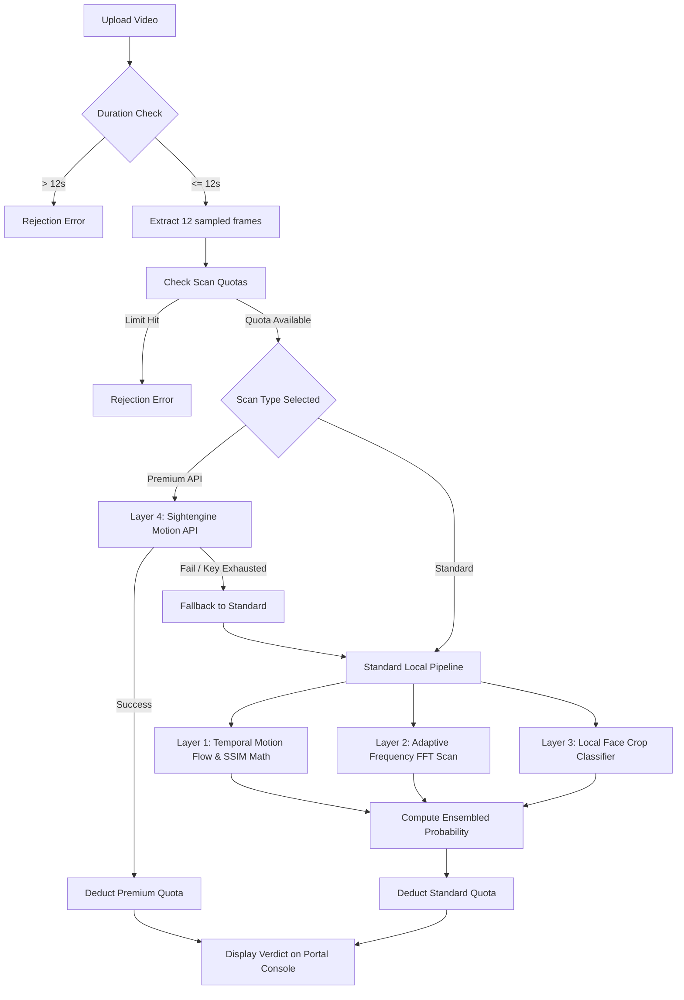

# DeepScan AI Video Detector

An intelligent, multi-layered video deepfake and generative AI detection system. The tool is styled as a retro-modern monospace developer terminal console, enabling frame-by-frame mathematical anomaly inspection, local deep learning model execution, and fallback to advanced commercial APIs.

## About the Project

DeepScan AI is designed to detect manipulated video content (face swaps, lip-syncs, and full generative AI synthesis). By combining low-level computer vision math, frequency domain analysis, deep learning classifiers, and optional enterprise APIs, it provides a high-confidence ensemble classification of media authenticity.

## System Architecture and Pipeline

The detection pipeline consists of four distinct analysis layers, executing sequentially based on the user's configurations and session quotas.

### Pipeline Flow



### The 4 Analysis Layers

#### 1. Layer 1: Temporal Motion Flow & SSIM Math (Local)
Computes frame-to-frame pixel displacements using dense optical flow (Farneback algorithm) and Structural Similarity Index (SSIM) over 12 uniformly sampled frames. Generative models and deepfakes often introduce sudden temporal inconsistencies or warping artifacts, which this layer flags by measuring spikes in motion vector variance and drops in structural correlation.

#### 2. Layer 2: Adaptive Frequency Domain FFT (Local)
Applies a 2D Fast Fourier Transform (FFT) on frame channels to analyze the frequency spectrum. Generative AI models (such as GANs and Diffusion networks) tend to leave subtle checkerboard patterns or high-frequency noise loss during upsampling. This layer calculates the ratio of high-frequency power to low-frequency power, normalizing the metric to resist compression artifacts.

#### 3. Layer 3: Local Face Crop Classifier (Local)
Uses a face detection framework (MediaPipe) to track and extract human faces across frames. The cropped face regions are passed to a local vision classifier (using EfficientNet-B4 architecture) to detect blending boundaries, unnatural eye blinking, or texture mismatches. If local GPU/CPU resources are constrained, a fallback visual edge-frequency classifier is engaged.

#### 4. Layer 4: Sightengine Premium API (Optional Cloud Fallback)
Leverages Sightengine's enterprise video analysis backend for state-of-the-art generative video detection. This cloud integration checks for motion abnormalities and model signatures from advanced generators like Sora, Kling, Runway, and Luma.

---

## Technical Specifications and Setup

### Prerequisites
* Python 3.9 or higher
* SQLite 3
* Git

### Installation

1. Clone the repository:
   ```bash
   git clone https://github.com/tawassulgoharellahi/ai_video_detector.git
   cd ai_video_detector
   ```

2. Install dependencies:
   ```bash
   pip install -r requirements.txt
   ```

3. Configure Environment Variables:
   Create a `.env` file in the root directory and add the following keys:
   ```env
   SIGHTENGINE_API_USER=your_sightengine_user_id
   SIGHTENGINE_API_SECRET=your_sightengine_secret_key
   GOOGLE_CLIENT_ID=your_google_oauth_client_id
   GOOGLE_CLIENT_SECRET=your_google_oauth_client_secret
   ```

### Database Schema
An SQLite database (`users.db`) is automatically initialized at startup. It maintains the following tables:
* **users**: Stores registered operator accounts, credentials, and OAuth provider IDs.
* **scans**: Logs the type of scan executed (standard/premium) and timestamps to enforce daily limits.
* **sessions**: Manages active operator login tokens and expiration schedules.

### Rate Limits
* **Maximum Video Duration**: 12 seconds.
* **Daily Total Scan Quota**: 5 scans per user.
* **Daily Premium Scan Quota**: 2 scans per user.

### Launching the Application
Run the following command to start the local server:
```bash
python app.py
```
Open `http://localhost:7860` in your web browser to access the portal interface.
